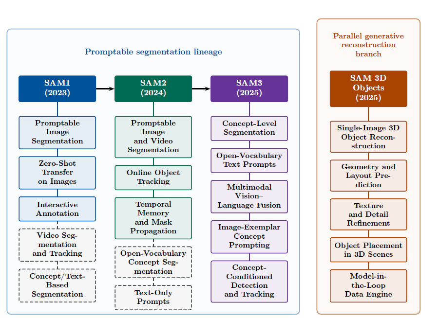

[](LICENSE)
[]()

# Taxonomy and Survey of Segment Anything Models (SAM-1, SAM-2, SAM-3 & SAM-3D): From Promptable Image Segmentation to Multimodal 3D Perception



## Abstract

Segment Anything Models (SAM) have reshaped visual perception since 2023 by establishing reusable, promptable interfaces for image segmentation, video object tracking, and concept-conditioned instance segmentation. This survey article develops a unified taxonomy that distinguishes the SAM1, SAM2, and SAM3 segmentation lineage from official Meta SAM 3D Objects, a parallel generative reconstruction branch, and community-developed three-dimensional extensions. Beginning with the foundations and motivation of promptable segmentation, we examine SAM1's image encoder, prompt encoder, mask decoder, and SA-1B data engine; SAM2's temporal memory, prompt persistence, and SA-V video supervision; and SAM3's vision-language fusion, Promptable Concept Segmentation, text and visual-exemplar conditioning, and concept-presence prediction. We subsequently analyze SAM 3D Objects through conditional flow matching, geometry and layout prediction, texture refinement, and multi-stage model-in-the-loop training. Cross-model comparisons connect architectural choices, training objectives, supervision scale, prompting mechanisms, and computational requirements with task-specific performance, while keeping segmentation and reconstruction evaluations distinct. Application evidence from agriculture, medical imaging, industrial inspection and manufacturing, and robotics clarifies how SAM-based adaptations support annotation, defect analysis, tracking, grasp estimation, and manipulation. The synthesis identifies a shift from spatially specified targets toward temporally persistent and semantically specified instances, without equating concept grounding with unrestricted reasoning or autonomous action. Persistent limitations include domain shift, temporal drift, language--vision conflict, attribute ambiguity, long-tail false positives, uncertain reconstruction, and deployment cost. We discuss architectural improvements, parameter-efficient adaptation, uncertainty estimation, model compression, and system integration as complementary research directions. The resulting perspective prioritizes reliable grounding, efficient adaptation, and evaluation that connects perceptual accuracy with downstream outcomes.

## Citation

If you find our work useful in your research, please consider citing:
```
@article{Sapkota2025SegmentAnythingModels,
  title={Taxonomy and Survey of Segment Anything Models (SAM1, SAM2, SAM3 & SAM 3D): From Promptable Masks to Concept-Level Image Segmentation via Multimodal Fusion},
  author={Ranjan Sapkota, Seyedali Mirjalili, Konstantinos I. Roumeliotis, Manoj Karkee},
  journal={arXiv preprint arXiv:},
  year={2025}
}
```

## Contents

- [Paper List](#paper-list)
  - [Seminal Papers](#seminal-papers)
  - [Follow-up Papers](#follow-up-papers)
    - [2026](Paper_List/paper_list_2026.md)
    - [2025](Paper_List/paper_list_2025.md)
    - [2024](Paper_List/paper_list_2024.md)
    - [2023](Paper_List/paper_list_2023.md)

## Paper List

### Seminal Papers

- **SAM:** Alexander Kirillov, Eric Mintun, Nikhila Ravi, Hanzi Mao, Chloe Rolland, Laura Gustafson, Tete Xiao, Spencer Whitehead, Alexander C. Berg, Wan-Yen Lo, Piotr Dollár, Ross Girshick.<br />
  "Segment Anything." **ICCV (2023) Best Paper Honorable Mention**.<br />
  [[paper](https://arxiv.org/abs/2304.02643)] [[homepage](https://segment-anything.com/)] [[code](https://github.com/facebookresearch/segment-anything)] [2023.04]

- **SAM 2:** Nikhila Ravi*, Valentin Gabeur*, Yuan-Ting Hu*, Ronghang Hu*, Chaitanya Ryali*, Tengyu Ma*, Haitham Khedr*, Roman Rädle*, Chloe Rolland, Laura Gustafson, Eric Mintun, Junting Pan, Kalyan Vasudev Alwala, Nicolas Carion, Chao-Yuan Wu, Ross Girshick, Piotr Dollár†, Christoph Feichtenhofer*,†.<br />
  "SAM 2: Segment Anything in Images and Videos." **ICLR (2025) Best Paper Honorable Mention**.<br />
  [[paper](https://arxiv.org/abs/2408.00714)] [[demo](https://sam2.metademolab.com/)] [[code](https://github.com/facebookresearch/segment-anything-2)] [[project](https://ai.meta.com/sam2)] [[dataset](https://ai.meta.com/datasets/segment-anything-video)] [[blog](https://ai.meta.com/blog/segment-anything-2)] [2024.07]

- **SAM 3:** Nicolas Carion*, Laura Gustafson*, Yuan-Ting Hu*, Shoubhik Debnath*, Ronghang Hu*, Didac Suris*, Chaitanya Ryali*, Kalyan Vasudev Alwala*, Haitham Khedr*, Andrew Huang, Jie Lei, Tengyu Ma, Baishan Guo, Arpit Kalla, Markus Marks, Joseph Greer, Meng Wang, Peize Sun, Roman Rädle, Triantafyllos Afouras, Effrosyni Mavroudi, Katherine Xu°, Tsung-Han Wu°, Yu Zhou°, Liliane Momeni°, Rishi Hazra°, Shuangrui Ding°, Sagar Vaze°, Francois Porcher°, Feng Li°, Siyuan Li°, Aishwarya Kamath°, Ho Kei Cheng°, Piotr Dollar†, Nikhila Ravi†, Kate Saenko†, Pengchuan Zhang†, Christoph Feichtenhofer†.<br />
  "SAM 3: Segment Anything with Concepts." arXiv (2025).<br />
  [[paper](https://arxiv.org/abs/2511.16719)] [[code](https://github.com/facebookresearch/sam3)] [[homepage](https://ai.meta.com/sam3/)] [2025.10]

- **SAM 3D:** SAM 3D Team, Xingyu Chen, Fu-Jen Chu, Pierre Gleize, Kevin J Liang, Alexander Sax, Hao Tang Weiyao Wang, Michelle Guo, Thibaut Hardin, Xiang Li, Aohan Lin, Jiawei Liu, Ziqi Ma, Anushka Sagar, Bowen Song, Xiaodong Wang, Jianing Yang, Bowen Zhang, Piotr Dollár, Georgia Gkioxari, MattFeiszli, Jitendra Malik.<br />
  "SAM 3D: 3Dfy Anything in Images." ArXiv (2025).<br />
  [[paper](https://ai.meta.com/research/publications/sam-3d-3dfy-anything-in-images/)] [[code](https://github.com/facebookresearch/sam-3d-objects)] [[project](https://ai.meta.com/sam3d/)] [[demo](https://www.aidemos.meta.com/segment-anything/editor/convert-image-to-3d)] [[blog](https://ai.meta.com/blog/sam-3d/)] [2025.11]

### Follow-up Papers

- [2026](Paper_List/paper_list_2026.md)
- [2025](Paper_List/paper_list_2025.md)
- [2024](Paper_List/paper_list_2024.md)
- [2023](Paper_List/paper_list_2023.md)
